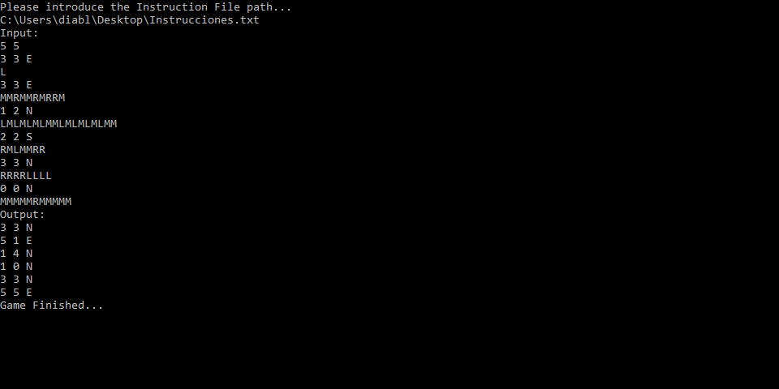
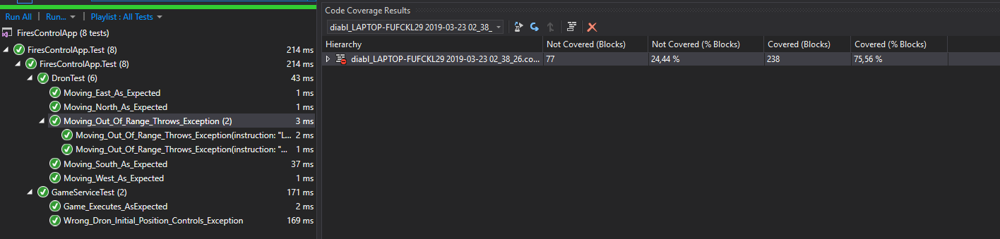

# FiresControlApp
### Develop by Jairo Blanco Aldao
### Made with Visual Studio 2019 
-----------------------------------------------------------------------------------------------------------

## 1. Introduction
The goal of this exercise is create a pseudo-game app that take some instructions as input and execute them follow the following conditions:

* First instruction define the forest area (Width and High).
* Second instruction defines the dron initial position and orientation.
* Next instructions can be re-positioning the dron or move and rotate the dron.
* Forest can't be resize once the object is initialize.
* Invalid instructions throw exception and stop the execution
* If the dron moves out of bounds the game it's over and an exception is shown and logged.

There are some conditions that weren't defined in the given exercise, so I decide to set this as the game constrains. The are plenty differents ways to implement and define the game's constrains, but this one feel good for me.

## 2. Implementation
Now I will explain how is the project architecture, implementation and some insteresting classes.

### 2.1 Architecture

The solution is divided in 4 folder, wich contains 1 project each (due to is a small solution/app):

1. Presentation: This layer includes all projects which they function is to presentate data to users (WS,WCF,WebUI,WebApi,etc).
2. Core: Contains all the main classes, interfaces, etc used by other application layers but not related with the main app aim.
3. Application: In this layer we can find the application main functionallity/code (services, entities, enums, etc).
4. Test: Test layer.

Just to clarify the difference between Core and Application layer is that code that is in Core Layer must be code that can be reused in differents layer of the app. This layer is important for fullfill the DRY (Don't Repeat Yourself) pattern.

### 2.2 Implementation
In this part I'll like to focus on the main classes or those classes that I think are more interesting.

#### Startup
```csharp
/// <summary>
    /// Contains the main bootstrap operations such as dependency injection registrations,
    /// appsettings configurations and logging.
    /// </summary>
    public abstract class Startup
    {
        protected readonly IServiceCollection _services = new ServiceCollection();

        protected Startup()
        {
            RegisterCore();
            RegisterPartials();
        }

        #region Public Methods

        /// <summary>
        /// Builds the service collection into a service provider instance.
        /// </summary>
        /// <returns>Service provider with all the pre-registered dependencies.</returns>
        public ServiceProvider Build()
        {
            return _services.BuildServiceProvider();
        }

        #endregion

        #region Abstract Methods

        /// <summary>
        /// Registers the configuration of the Daemon.
        /// </summary>
        /// <remarks>
        /// Must be overriden by the WindowsService layer implementation.
        /// </remarks>
        protected abstract void RegisterPartials();

        #endregion

        #region Private Methods

        /// <summary>
        /// Registers core dependencies and configurations.
        /// </summary>
        private void RegisterCore()
        {
            string application = AppDomain.CurrentDomain.FriendlyName;

            Log.Logger = new LoggerConfiguration()
                .WriteTo.Console()
                .WriteTo.File($"C:\\FireControlApp\\Logs\\{application}\\{application}.log", rollingInterval: RollingInterval.Day, retainedFileCountLimit: int.MaxValue)
                .CreateLogger();
        }

        #endregion

        #region Protected Methods

        /// <summary>
        /// Registers a partial Startup with its configuration and its services.
        /// </summary>
        /// <typeparam name="T">Partial type to register.</typeparam>
        protected void RegisterPartial<T>() where T : IPartialStartup, new()
        {
            T partialStartup = new T();

            partialStartup.RegisterServices(_services);
        }


        #endregion
    }
```

In .Net Core 2.1 windows service are not provide with Startup.cs and Program.cs class as WebApi project. This fact makes more tough use the IoC pattern, for this reason I decided to create a generic abstract class wich allows me to implement it in each presentation project (in case that we had more than one) and register all the dependencies. In this solution, the complexity of the projects was to low and no ServiceRegistration was needed in the presentation layer, but in case that we should register Services we can create: public abstract void RegisterServices() wich is in charge on register presentation layer dependencies. We could also add a IConfiguration for import all the configuration that the apps need (in this case I decide to use no config files). 
Thanks to the interfaces IPartialStartup:

```csharp
/// <summary>
    /// Partial Startup to be registered with the service bootstrapping.
    /// </summary>
    public interface IPartialStartup
    {
        /// <summary>
        /// Registers the services of the library.
        /// </summary>
        /// <param name="services">Service collection to register the services into.</param>
        void RegisterServices(IServiceCollection services);
    }
```

Implementation example:
```csharp
public class GamePartialStartup : IPartialStartup
    {

        public void RegisterServices(IServiceCollection services)
        {
            services.AddSingleton<IFileReaderService, FileReaderService>();
            services.AddSingleton<IGameService, GameService>();
        }
    }
```

With this interface we can "tell" to every layer to register itself their dependencies, for example if I create a WebApi project and I need to use FiresControlApp.Game services, I just need to call the RegisterPartial<GamePartialStartup>() in the RegisterPartials() abstract method and the required services will be inyected to the IServiceCollection.

The class GameService contains the application main functionallity
```csharp
     public class GameService : IGameService
    {
        #region Properties
        private Dron _dron;
        private Forest _forest;
        private IFileReaderService _fileReader;
        private List<string> _instructions;
        private List<char> _cardinalPoints = new List<char>() { 'N', 'S', 'W', 'E' };
        #endregion

        public GameService(IFileReaderService fileReader)
        {
            _fileReader = fileReader;
        }

        #region Public Methods

        public void LoadConfiguration(string path)
        {
            try
            {
                Console.WriteLine("Input:");
                _instructions = _fileReader.ReadInstructionsFile(path).ToList();
            }
            catch (Exception ex)
            {
                Log.Error($"Error loading configuration: {ex.ToString()}");
                Console.WriteLine($"Uops, something happend when Setting Game Configuration: {ex.Message}");
            }
        }

        public void Start()
        {
            try
            {
                Console.WriteLine("Output:");

                foreach (string instruction in _instructions)
                {
                    ExecuteInstruction(instruction);
                }
            }
            catch (Exception ex)
            {
                Console.WriteLine("Uops, an error happend during game execution, please check logs for more information.");
                Log.Error($"Error happend during Game Execution: {ex.ToString()}");
            }
        }

        #endregion

        #region Private Methods

        /// <summary>
        /// Splits the current instruction, pares and gets de dimension parameters
        /// </summary>
        /// <param name="dimension">(width,high)</param>
        private void SetForestDimensions(string[] instruction)
        {
            if (_forest == null) throw new GameException("Forest can't be resize.");

            int width;
            int high;

            if (!Int32.TryParse(instruction[0], out high))
                throw new FormatException("Error parsing High Forest paremeter, please introduce a valid number");

            if (!Int32.TryParse(instruction[1], out width))
                throw new FormatException("Error parsing Width Forest paremeter, please introduce a valid number");

            _forest = new Forest() { High = high, Width = width };

        }

        private void SetDronInitialPosition(string[] instruction)
        {
            int x;
            int y;
            char direction;

            if (!Int32.TryParse(instruction[0], out x))
                throw new FormatException("Error parsing X position of Dron paremeter, please introduce a valid number.");

            if (!Int32.TryParse(instruction[1], out y))
                throw new FormatException("Error parsing Y position of Dron paremeter, please introduce a valid number.");

            if (!char.TryParse(instruction[2], out direction))
                throw new FormatException("Error parsing Direction of Dron paremeter, please introduce a valid direction (char).");

            if (x <= _forest.Width && y <= _forest.High && _cardinalPoints.Contains(direction))
            {
                _dron = new Dron(x, y, direction, _forest);
            }
            else
            {
                throw new FormatException("X position and Y position can't be hight than forest dimensions and direction must be one cardinal point");
            }

        }

        private void ExecuteInstruction(string instruction)
        {
            string[] splitedInstruction = instruction.Split(' ');

            switch (splitedInstruction.Length)
            {
                case (int)InstructionEnum.MoveDronInstruction:
                    _dron.ExecuteInstructions(instruction);
                    break;
                case (int)InstructionEnum.SetDronPositionInstruction:
                    SetDronInitialPosition(splitedInstruction);
                    break;
                case (int)InstructionEnum.SetForestDimensionInstruction:
                    SetForestDimensions(splitedInstruction);
                    break;
                default:
                    throw new GameException("Invalid Instruction");
            }
        }

        #endregion

    }
```

No complex logic or algorithm has been used during the develop of this class or the application and coding rules from "Code Clean" has been used to facilitate understanding and readability of the code. The absence of comments is explain in "Clean Code" book but I think it's not but idea to mention it: if you have to comment a method it's because the method name is wrong or the method do more things than it should do, so you have to split it in multiple methods.

Just to mention, with this implementation, each exception is considered as critical, so it throws exception and finish the execution. This could've been done in a different way, but I think this is more proper to avoid complexity.

Testing Project is just added for show knoledge in this area and testing patterns but it's not really important, in fact, I think integration test are useless in this application so I decide don't include it.

### 3. Instructions

For run the application we should use Visual Studio 2019 (maybe VS2017 or VSCode can be used):

* Create a file with instructions or use the one in git root.
* Set as start project "FiresControlApp.WindowsService" and press Start.
* Copy the file path (e.g "C:\user\Desktop\Instrucciones.txt") and pasted on the Windows Console (right click) and press enter.

Example Result: 


If we want to see the test results and the Code Coverage:
* Open Test Explorer
* Right click and press on "Analyze Code Coverage on Selected Test"
* After execution you will see the following window.

Code Coverage Result:


### 4. Conclusion
I know this approach it's not the most efficient, creative or complex but I tried to show as much programming knoledge as I can trying to use differents collections, classes, types, etc. Probably not my best development, specially with the duplicate Forest/CardinalPoints property in GameService and Dron wich is not according with DRY pattern, in fact KISS principle is followed in each line code of the app.

Maybe I could add more complexity, more constrains, testing, etc, but I wanted to waste 3-4 hours as much to be honest with the time specifications, so... that's all. 

Thanks for reading!

